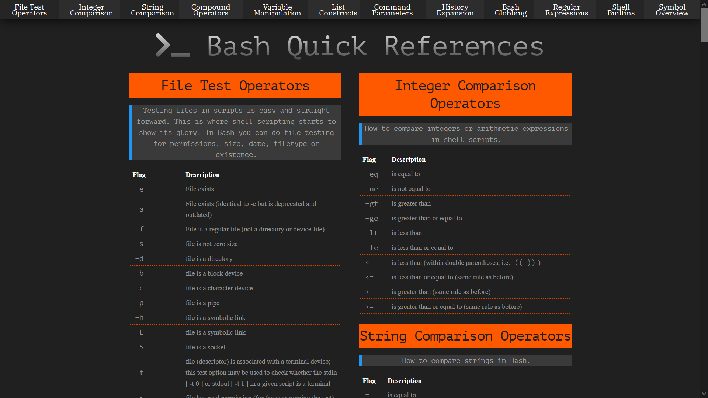

<h1 align="center">
  
</h1>

:star: Star us on GitHub it helps!

Find the notes at: [www.ShellMagic.xyz](http://www.shellmagic.xyz)

  
                
                
                

# How to Contribute
Make a pull request.
